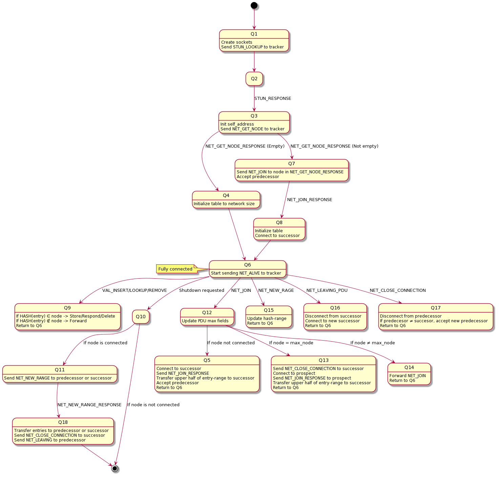

# NodeTracker

## Description

This project implements a node (node.c) for a **distributed hash table (DHT)**. Each node participates in a network where it stores, retrieves, and forwards key-value pairs. The node communicates with other nodes to maintain consistent data distribution and replication. It supports:

- Insertion, lookup, and removal of key-value pairs (CRUD operations)
- Dynamic joining and leaving of nodes in the network
- Data transfer between nodes when hash ranges are updated

The node was implemented with a classmate, and the code for the tracker and client was provided by the lecturer

The node was based on this state machine:



## Features

- UDP and TCP communication between nodes and tracker
- Hash-based key distribution with automatic range updates
- Forwarding of requests to the correct node based on hash range
- Graceful shutdown and data transfer to successor/predecessor
- Non-blocking sockets and polling for efficient I/O
- Logging of actions for debugging and monitoring
- Can join a network of nodes built in rust by the lecturer

**Run Instructions:**  
Instructions for creating a network of two nodes with tracker on port 1111

1. **Navigate to the project folder**:
   ```bash
   cd path/to/NodeTracker

2. **Build the project**
   ```bash
   make
   gcc server.c
   gcc client.c

3. **Start the tracker**:
   ```bash
   ./tracker 1111

4. **Start the first node (in separate terminal)**:
   ```bash
   ./node 0.0.0.0 1111

5. **Start the second node (in separate terminal)**:
   ```bash
   ./node 0.0.0.0 1111
   
6. **Start the client (in separate terminal)**:
   ```bash
   ./client --tracker 0.0.0.0:1111

**Author:** 
Joakim Wiksten (and classmate)
